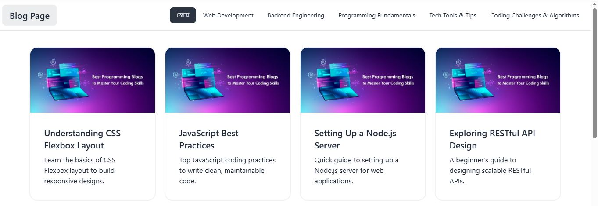
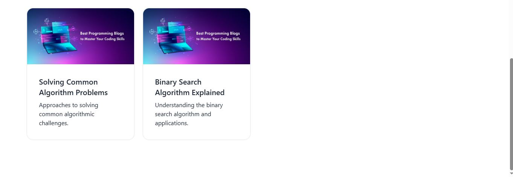

# Blog Frontend

This project is a responsive blog frontend designed to deliver a clean, modern, and user-friendly reading experience.
The application is built with **React.js** and **Tailwind CSS**, focusing on performance, usability, and responsive design.

It integrates with a **REST API** using **Axios** to dynamically fetch and manage blog content, allowing users to browse and read blog posts smoothly.

---

---

## Project Preview

Below are some screenshots demonstrating the blog interface and layout.





---

## Features

* Fully responsive design for desktop, tablet, and mobile devices
* Modern UI built with **Tailwind CSS**
* Blog posts fetched dynamically from a REST API
* Fast and efficient data fetching using **Axios**
* Clean layout focused on readability and usability
* Smooth navigation for better user experience

---

## Tech Stack

**Frontend**

* React.js

**Styling**

* Tailwind CSS

**API Communication**

* Axios
* REST API

---

## Project Structure

```
project-root
│
├── src
│   ├── components
│   ├── pages
│   ├── services
│   └── App.js
│
├── public
│
├── package.json
│
└── README.md
```

---


